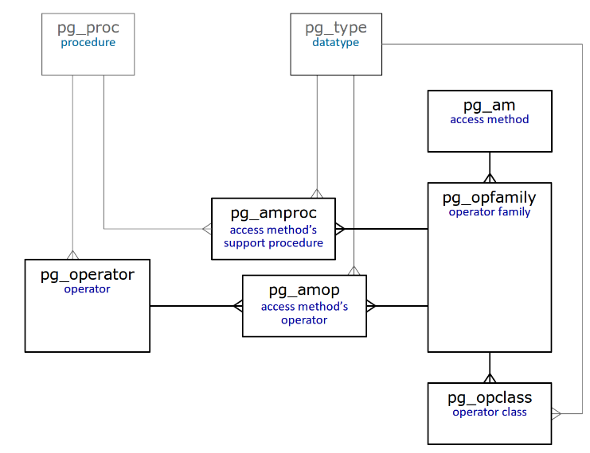

在第一篇文章中，我们提到了访问方法必须提供有关其自身的信息。让我们看一下访问方法接口的结构。

# 属性

每一种索引方法在pg_am表（“am”：access method）中包含一行（内部被称为访问方法）。PostgreSQL中内建了对表常规访问的支持，但是所有的索引方法则是在pg_am中描述。我们可以从同一张表中获得可用方法的列表：


```SQL
postgres=# select amname from pg_am;
 amname
--------
 heap
 btree
 hash
 gist
 gin
 spgist
 brin
(7 rows)
```
在PostgreSQL 9.5和更低的版本中，每个属性都由«pg_am»表的单独字段表示。从9.6版开始，使用特殊函数查询属性，并将其分为几层：

- 访问方法属性—«pg_indexam_has_property»
- 特定索引的属性—«pg_index_has_property»
- 索引各列的属性—«pg_index_column_has_property»

以后，访问方法层和索引层将是分开的：到目前为止，所有基于一种访问方法的索引将始终具有相同的属性。

以下四个属性是访问方法的属性（以«btree»为例）：


```SQL
postgres=# select a.amname, p.name, pg_indexam_has_property(a.oid,p.name)
            from pg_am a,
            unnest(array['can_order','can_unique','can_multi_col','can_exclude']) p(name)
            where a.amname = 'btree'
            order by a.amname;
 amname |     name      | pg_indexam_has_property
--------+---------------+-------------------------
 btree  | can_order     | t
 btree  | can_unique    | t
 btree  | can_multi_col | t
 btree  | can_exclude   | t
(4 rows)
```


- can_order。
访问方法是否支持ASC、DESC以及CREATE
INDEX中的有关关键词（到目前为止仅适用于“ btree”）。
- can_unique。
访问方法是否支持唯一索引（仅适用于“ btree”）。
- can_multi_col。
访问方法是否支持多列索引。
- can_exclude。
访问方法是否支持排除约束。

以下属性与索引有关（例如，让我们考虑现有索引）：


```SQL
postgres=# select p.name, pg_index_has_property('t_a_idx'::regclass,p.name)
           from unnest(array['clusterable','index_scan','bitmap_scan','backward_scan']) p(name);
     name      | pg_index_has_property
---------------+-----------------------
 clusterable   | t
 index_scan    | t
 bitmap_scan   | t
 backward_scan | t
(4 rows)
```


- clusterable。
索引是否可以用于CLUSTER命令。
- index_scan。
索引是否支持普通扫描（非位图）。虽然这个属性看起来很奇怪，但并不是所有索引都可以逐个返回tid——有些索引一次返回所有结果，并且只支持位图扫描。
- bitmap_scan。
索引是否支持位图扫描。
- backward_scan。
在扫描中扫描方向能否被更改（为了支持游
标上无需物化的FETCH BACKWARD）。

最后，以下是列属性：


```SQL
postgres=# select p.name, pg_index_column_has_property('t_a_idx'::regclass,1,p.name)
			from unnest(array[
			'asc','desc','nulls_first','nulls_last','orderable','distance_orderable',
			'returnable','search_array','search_nulls'
			]) p(name);
        name        | pg_index_column_has_property
--------------------+------------------------------
 asc                | t
 desc               | f
 nulls_first        | f
 nulls_last         | t
 orderable          | t
 distance_orderable | f
 returnable         | t
 search_array       | t
 search_nulls       | t
(9 rows)
```


- asc，desc，nulls_first，nulls_last，orderable。
这些属性与值的排序有关（对“ btree”索引描述时，我们将讨论它们）。
- distance_orderable。
列能否通过一个“distance”操作符（例如ORDER BY col <-> constant）有序地扫描（到目前为止仅适用于GiST和RUM索引）。
- returnable。
列值是否可以通过一次只用索引扫描返回，即使用索引而不访问表的可能性，即index-only scans 的支持。
- search_array。
列是否支持col = ANY(array)搜索。支持使用表达式 «indexed-field IN (list_of_constants)» 搜索多个值，这与 «indexed-field = ANY(array_of_constants)»相同。
- search_nulls。
列是否支持IS NULL和IS NOT NULL搜索。

我们已经详细讨论了一些属性。一些属性特定于某些访问方法。在考虑这些特定方法时，我们将讨论这些属性。

# 操作符类和族

除了接口公开的访问方法的属性之外，还需要了解访问方法接受哪些数据类型和哪些操作符（operator）。为此，PostgreSQL引入了操作符类和操作符族的概念。

操作符类包含用于索引的最小操作符集（可能还有支持函数），以操作某种数据类型。

例如，我们定义了一个新数据类型后，还不能在新数据类型的列上定义索引。为了能工作，索引方法还要求可操作的操作符和额外的支持函数。

  **译者注：**
  一个索引方法的程序并不直接了解它将要操作的数据类型。而是由一个操作符类标识索引方法用来操作一种特定数据类型的一组操作。之所以被称为操作符类是因为它们指定的一件事情就是可以被用于一个索引的WHERE子句操作符集合（即，能被转换成一个索引扫描条件）。一个操作符类也能指定一些索引方法内部操作所需的支持函数，这些过程不能直接对应于能用于索引的任何WHERE子句操作符。可以为相同的数据类型和索引方法定义多个操作符类。通过这种方式，可以为一种数据类型定义多个索引语义集合。例如，B-树索引方法必须能比较两个键并且决定其中一个是否大于、等于或小于另一个。类似地，哈希索引方法必须能够为键值计算哈希码。这些操作并不对应在 SQL 命令的条件中使用的操作符。它们是索引方法在内部使用的管理函数。

操作符类包含在某些操作符族中。此外，一个操作符族可以包含多个操作符类。例如，«integer_ops»操作符族包括«int8_ops»类、«int4_ops»类和«int2_ops»类，这些类的类型对应«bigint»、«integer»和«smallint»数据类型，它们的大小不同，但含义相同。


```SQL
postgres=# select opfname, opcname, opcintype::regtype
            from pg_opclass opc, pg_opfamily opf
            where opf.opfname = 'integer_ops'
            and opc.opcfamily = opf.oid
            and opf.opfmethod = (
                  select oid from pg_am where amname = 'btree'
                );
   opfname   | opcname  | opcintype
-------------+----------+-----------
 integer_ops | int2_ops | smallint
 integer_ops | int4_ops | integer
 integer_ops | int8_ops | bigint
(3 rows)
```


另一个示例：«datetime_ops»系列包括操作日期的操作符类（有时间和无时间）：


```SQL
postgres=# select opfname, opcname, opcintype::regtype
            from pg_opclass opc, pg_opfamily opf
            where opf.opfname = 'datetime_ops'
            and opc.opcfamily = opf.oid
            and opf.opfmethod = (
                  select oid from pg_am where amname = 'btree'
                );
   opfname    |     opcname     |          opcintype          
--------------+-----------------+-----------------------------
 datetime_ops | date_ops        | date
 datetime_ops | timestamptz_ops | timestamp with time zone
 datetime_ops | timestamp_ops   | timestamp without time zone
(3 rows)
```

操作符族还可以包含其他操作符来比较不同类型的值（比如比较int2和int4两种不同类型的值）。按族分组使计划器可以对具有不同类型值的谓词使用索引。一个族还可以包含其他辅助函数。


在大多数情况下，我们不需要知道任何关于操作符族和类的信息。通常我们只是创建一个索引，默认情况下使用某个操作符类。

但是，我们可以显式地指定操作符类。下面是一个需要显式指定的简单示例：在 collation 不是 C 的数据库中，常规索引不支持LIKE操作：


```SQL
postgres=# show lc_collate;
 lc_collate 
-------------
 en_US.UTF-8
(1 row)

postgres=# explain (costs off) select * from t where b like 'A%';
         QUERY PLAN          
-----------------------------
 Seq Scan on t
   Filter: (b ~~ 'A%'::text)
(2 rows)
```


我们可以通过使用操作符类“ text_pattern_ops”创建索引来克服此限制（注意执行计划中的条件的变化）：


```SQL
postgres=# create index on t(b text_pattern_ops);

postgres=# explain (costs off) select * from t where b like 'A%';
                           QUERY PLAN                          
----------------------------------------------------------------
 Bitmap Heap Scan on t
   Filter: (b ~~ 'A%'::text)
   ->  Bitmap Index Scan on t_b_idx1
         Index Cond: ((b ~>=~ 'A'::text) AND (b ~<~ 'B'::text))
(4 rows)
```


# 系统目录

总结了系统目录中与操作符类和族直接相关的表的简化图。  




系统目录使我们无需查找文档即可找到许多问题的答案。例如，

某种访问方法可以操纵哪些数据类型？


```SQL
postgres=# select opcname, opcintype::regtype
            from pg_opclass
            where opcmethod = (select oid from pg_am where amname = 'btree')
            order by opcintype::regtype::text;
       opcname       |          opcintype          
---------------------+-----------------------------
 abstime_ops         | abstime
 array_ops           | anyarray
 enum_ops            | anyenum
...
```


操作符类包含哪些操作符（因此，索引访问可用于包含该操作符的条件）？


```SQL
postgres=# select amop.amopopr::regoperator
			from pg_opclass opc, pg_opfamily opf, pg_am am, pg_amop amop
			where opc.opcname = 'array_ops'
			and opf.oid = opc.opcfamily
			and am.oid = opf.opfmethod
			and amop.amopfamily = opc.opcfamily
			and am.amname = 'btree'
			and amop.amoplefttype = opc.opcintype;
        amopopr        
-----------------------
 <(anyarray,anyarray)
 <=(anyarray,anyarray)
 =(anyarray,anyarray)
 >=(anyarray,anyarray)
 >(anyarray,anyarray)
(5 rows)
```


# 英文地址：
https://habr.com/en/company/postgrespro/blog/442546/

# 参考：
https://www.postgresql.org/docs/12/xindex.html